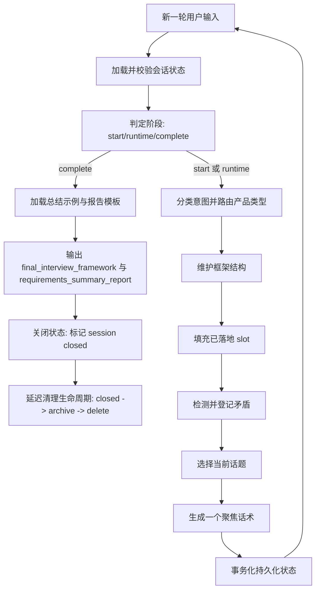

<p align="center">
  
</p>

<h1 align="center">需求访谈技能</h1>

<p align="center">
  <a href="./README.md"><strong>英文版</strong></a>
</p>

<p align="center">
  面向生产场景的可持久化半结构化需求访谈 Skill。
  将模糊想法沉淀为可追踪、结构化需求产物。
</p>

## 这个技能能做什么
- 以自适应多轮访谈替代一次性问卷。
- 维护带有置信度与证据链的访谈框架。
- 支持需求演进过程中的动态话题调整。
- 识别、记录并优先澄清需求矛盾。
- 最终输出两个产物：
  - `final_interview_framework`（JSON）
  - `requirements_summary_report`（Markdown）

## 支持的工具

本技能内置安装脚本，可支持以下工具使用：
- Claude Code
- GitHub Copilot（与 Claude Code 共用全局技能目录）
- Cursor（通过自动生成 `.mdc` 适配规则）
- Windsurf（通过自动生成规则 markdown）
- Codex CLI
- Gemini CLI
- Kiro

安装器会写入标准 skill 目录链接/副本，并为 Cursor/Windsurf 生成规则适配文件。

## 快速开始

### 1) 克隆
```bash
git clone https://github.com/EchoAran/requirements-elicitation-skill.git
cd requirements-elicitation-skill
```

### 2) 安装（Unix/macOS）
```bash
chmod +x install.sh
./install.sh
```

可选：
```bash
./install.sh --dry-run
./install.sh --uninstall
```

### 3) 安装（Windows PowerShell）
```powershell
.\install.ps1
```

可选：
```powershell
.\install.ps1 -DryRun
.\install.ps1 -Uninstall
```

### 4) 使用

在你的 Agent 中发起需求访谈，例如：
- “请帮我做一个校园二手交易 App 的需求访谈。”
- “请帮我澄清企业内部审批工具的 MVP 需求。”

## 仓库结构
```text
.
├── SKILL.md                                # Skill frontmatter 与主流程编排
├── INTEGRATION.md                          # 宿主无关接入手册（分档位与契约）
├── README.md                               # 英文文档
├── README-zh.md                            # 中文文档
├── install.sh                              # 面向多工具的 Unix/macOS 安装脚本
├── install.ps1                             # 面向多工具的 PowerShell 安装脚本
├── config/
│   └── state.json.example                  # 可选 state_root 覆盖模板
├── assets/
│   ├── interview_framework_schema.json     # 运行时 schema（v2）
│   └── requirements_report_format.md       # 最终报告模板
├── references/
│   ├── checkpoints.md
│   ├── conflict_resolution.md
│   ├── fill_framework.md
│   ├── generate_speak.md
│   ├── intent_routing.md
│   ├── maintain_framework.md
│   ├── select_current_topic.md
│   ├── topic_dependency_map.md
│   ├── state_management.md
│   ├── state_storage_rules.md
│   ├── state_lifecycle.md
│   └── state_cleanup.md
├── scripts/
│   ├── commit_state.py                     # 事务提交（tmp + checkpoint + commit.json）
│   ├── validate_state.py                   # Schema 与跨文件一致性校验
│   ├── check_state_drift.py                # 漂移检测 + 迁移 + 回滚
│   ├── security_scan_state.py              # 状态文件敏感信息扫描
│   ├── cleanup_sessions.py                 # 两阶段归档/删除生命周期清理
│   ├── state_doctor.py                     # 统一 validate/repair/migrate 入口
│   ├── storage_adapter.py                  # 最小存储适配器契约 + 文件后端实现
│   ├── state_lib/                          # 可复用状态操作库
│   └── run_state_tests.py                  # 状态层回归测试运行脚本
├── examples/
│   ├── new_framework_example.md
│   ├── fill_framework_example.md
│   ├── modify_framework_example.md
│   ├── select_current_topic_example.md
│   ├── generate_speak_example.md
│   ├── contradiction_resolution_example.md
│   ├── intent_routing_example.md
│   ├── summarize_example.md
│   ├── frequent_topic_switch_example.md
│   ├── refusal_to_answer_example.md
│   ├── conflicting_priorities_example.md
│   └── goal_without_workflow_example.md
└── tests/
    ├── README.md
    └── state_cases/
        ├── 01_normal_persistence_case.json
        ├── 02_interrupted_write_recovery_case.json
        ├── 03_duplicate_turn_retry_case.json
        └── 04_old_schema_migration_case.json
```

## 运行循环

每一轮用户输入，技能按以下顺序执行：
1. 加载并校验会话状态。
2. 判定阶段（`start`、`runtime`、`complete`）。
3. 路由意图与产品类型。
4. 维护框架结构。
5. 填充已落地的 slot 值。
6. 检测并登记矛盾。
7. 选择下一话题。
8. 生成一个聚焦的问题或确认语句。
9. 以事务方式持久化状态。

### 运行流程图（Mermaid）



## 状态与可追踪模型（v2）
- 显式维护 `schema_version` 与 `state_version`。
- `evidence` 使用严格对象数组：
  - `turn_id`
  - `excerpt`
  - `timestamp`
  - `confidence_note`
- 使用稳定 `turn_id` 实现重试幂等。
- 状态读取以 `CURRENT -> revisions/<revision_id>/` 为准，保证读取侧原子一致性。
- 通过 `commit.json` 记录最近一次成功提交锚点。
- 通过 `checkpoints/v{n}` 保留回滚快照。
- 两阶段清理生命周期：
  - `active -> closed -> archive -> delete`
- 存储可移植性：
  - 核心持久化可抽象为 `StorageAdapter` 契约（`load_current`、`commit_revision`、`mark_closed`、`archive_session`）
  - 原子接入操作：`state_load`、`state_commit`、`state_mark_closed`、`state_doctor`

## 工具安装目标路径

安装器会为下列路径创建链接/副本：
- `~/.claude/skills/<skill-name>`（兼容 Claude Code + Copilot）
- `~/.agents/skills/<skill-name>`（Codex CLI / Gemini CLI / Kiro 的通用路径）
- `~/.codex/skills/<skill-name>`（可选显式路径）
- `~/.gemini/skills/<skill-name>`（可选显式路径）
- `~/.kiro/skills/<skill-name>`（可选显式路径）

安装器还会生成：
- Cursor 规则适配：`.cursor/rules/<skill-name>.mdc`（或 `CURSOR_RULES_DIR`）
- Windsurf 规则适配：`.windsurf/rules/<skill-name>.md`（或 `WINDSURF_RULES_DIR`）

## 脚本入口
```bash
python scripts/validate_state.py --state-root state --session-id <SESSION_ID>
python scripts/check_state_drift.py --state-root state --session-id <SESSION_ID> --migrate
python scripts/security_scan_state.py --state-root state
python scripts/cleanup_sessions.py --state-root state --archive-days 30 --delete-days 90
python scripts/state_doctor.py --state-root state --session-id <SESSION_ID> --action validate
python scripts/run_state_tests.py
```

## 测试用例

`tests/state_cases/` 提供状态层回归场景：
- 正常持久化
- 中断写入恢复
- 重复 turn 重试幂等
- 旧 schema 迁移与回滚

## 兼容性说明
- 本仓库的规范 Skill 内容由 `SKILL.md` 提供。
- Cursor/Windsurf 通过自动生成的适配规则获得支持。
- 通用宿主接入说明见 `INTEGRATION.md`。
- 如果团队使用自定义路径，可设置：
  - `CURSOR_RULES_DIR`
  - `WINDSURF_RULES_DIR`

## 许可证
专有许可（见 `SKILL.md` frontmatter）。
