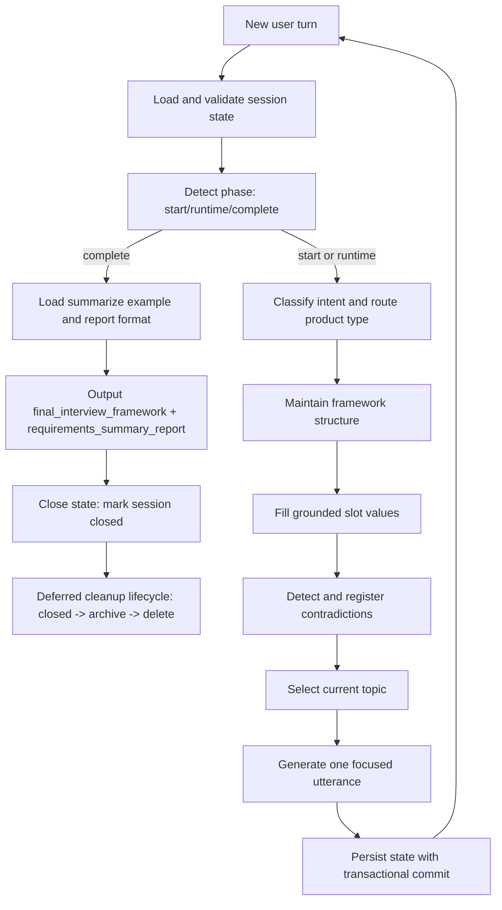

<p align="center">
  
</p>

<h1 align="center">Requirements Elicitation Skill</h1>

<p align="center">
  <a href="./README-zh.md"><strong>Chinese Version</strong></a>
</p>

<p align="center">
  Production-oriented, stateful semi-structured requirements interviews.
  Turn vague ideas into traceable requirement artifacts.
</p>

## What This Skill Does
- Runs adaptive multi-turn interviews instead of one-shot questionnaires.
- Maintains an interview framework with explicit confidence and evidence.
- Supports dynamic topic updates as requirements evolve.
- Detects, records, and resolves requirement contradictions.
- Produces two final artifacts:
  - `final_interview_framework` (JSON)
  - `requirements_summary_report` (Markdown)

## Supported Tools

This skill includes installer scripts that support usage across:
- Claude Code
- GitHub Copilot (same global skill path as Claude Code)
- Cursor (via generated `.mdc` adapter rule)
- Windsurf (via generated rule markdown)
- Codex CLI
- Gemini CLI
- Kiro

The installer writes links/copies into standard skill directories and generates rule adapters for Cursor/Windsurf.

## Quick Start

### 1) Clone
```bash
git clone https://github.com/EchoAran/requirements-elicitation-skill.git
cd requirements-elicitation-skill
```

### 2) Install (Unix/macOS)
```bash
chmod +x install.sh
./install.sh
```

Optional:
```bash
./install.sh --dry-run
./install.sh --uninstall
```

### 3) Install (Windows PowerShell)
```powershell
.\install.ps1
```

Optional:
```powershell
.\install.ps1 -DryRun
.\install.ps1 -Uninstall
```

### 4) Run

Start your agent and trigger a requirements interview, for example:
- "Help me run a requirements interview for a campus marketplace app."
- "Please clarify MVP requirements for our internal approval tool."

## Repository Structure
```text
.
├── SKILL.md                                # Skill frontmatter + orchestration flow
├── README.md                               # English documentation
├── README-zh.md                            # Chinese documentation
├── install.sh                              # Unix/macOS installer for multi-tool usage
├── install.ps1                             # PowerShell installer for multi-tool usage
├── assets/
│   ├── interview_framework_schema.json     # Runtime schema (v2)
│   └── requirements_report_format.md       # Final report template
├── references/
│   ├── checkpoints.md
│   ├── conflict_resolution.md
│   ├── fill_framework.md
│   ├── generate_speak.md
│   ├── intent_routing.md
│   ├── maintain_framework.md
│   ├── select_current_topic.md
│   ├── topic_dependency_map.md
│   ├── state_management.md
│   ├── state_storage_rules.md
│   ├── state_lifecycle.md
│   └── state_cleanup.md
├── scripts/
│   ├── commit_state.py                     # Transactional commit (tmp + checkpoint + commit.json)
│   ├── validate_state.py                   # Schema + cross-file consistency validation
│   ├── check_state_drift.py                # Drift detection + migration + rollback
│   ├── security_scan_state.py              # Sensitive-content scan for state files
│   ├── cleanup_sessions.py                 # Two-phase archive/delete lifecycle cleanup
│   ├── storage_adapter.py                  # Minimal storage adapter contract + file backend
│   └── run_state_tests.py                  # State-layer regression runner
├── examples/
│   ├── new_framework_example.md
│   ├── fill_framework_example.md
│   ├── modify_framework_example.md
│   ├── select_current_topic_example.md
│   ├── generate_speak_example.md
│   ├── contradiction_resolution_example.md
│   ├── intent_routing_example.md
│   ├── summarize_example.md
│   ├── frequent_topic_switch_example.md
│   ├── refusal_to_answer_example.md
│   ├── conflicting_priorities_example.md
│   └── goal_without_workflow_example.md
└── tests/
    ├── README.md
    └── state_cases/
        ├── 01_normal_persistence_case.json
        ├── 02_interrupted_write_recovery_case.json
        ├── 03_duplicate_turn_retry_case.json
        └── 04_old_schema_migration_case.json
```

## Runtime Loop

For each user turn, the skill runs:
1. Load and validate session state.
2. Detect phase (`start`, `runtime`, `complete`).
3. Route intent and product type.
4. Maintain framework structure.
5. Fill grounded slot values.
6. Detect and register contradictions.
7. Select next topic.
8. Generate one focused next utterance.
9. Persist state with transactional commit.

### Runtime Flow (Mermaid)



## State and Traceability Model (v2)
- `schema_version` and `state_version` are explicit.
- Evidence is a strict object array:
  - `turn_id`
  - `excerpt`
  - `timestamp`
  - `confidence_note`
- Retry-safe writes use stable `turn_id`.
- State reads resolve via `CURRENT -> revisions/<revision_id>/` for atomic consistency.
- `commit.json` records the last successful commit pointer.
- `checkpoints/v{n}` keep rollback snapshots.
- Two-phase cleanup lifecycle:
  - `active -> closed -> archive -> delete`
- Storage portability:
  - Core persistence can be abstracted through `StorageAdapter` contract (`load_current`, `commit_revision`, `mark_closed`, `archive_session`)

## Tool Install Targets

The installer creates links/copies for:
- `~/.claude/skills/<skill-name>` (Claude Code + Copilot compatibility path)
- `~/.agents/skills/<skill-name>` (universal path for Codex CLI / Gemini CLI / Kiro workflows)
- `~/.codex/skills/<skill-name>` (optional explicit path)
- `~/.gemini/skills/<skill-name>` (optional explicit path)
- `~/.kiro/skills/<skill-name>` (optional explicit path)

The installer also generates:
- Cursor adapter rule: `.cursor/rules/<skill-name>.mdc` (or `CURSOR_RULES_DIR`)
- Windsurf adapter rule: `.windsurf/rules/<skill-name>.md` (or `WINDSURF_RULES_DIR`)

## Script Entrypoints
```bash
python scripts/validate_state.py --state-root state --session-id <SESSION_ID>
python scripts/check_state_drift.py --state-root state --session-id <SESSION_ID> --migrate
python scripts/security_scan_state.py --state-root state
python scripts/cleanup_sessions.py --state-root state --archive-days 30 --delete-days 90
python scripts/run_state_tests.py
```

## Test Cases

State-focused regression scenarios are in `tests/state_cases/`:
- Normal persistence
- Interrupted write recovery
- Duplicate-turn retry idempotency
- Old-schema migration and rollback

## Compatibility Notes
- This repository ships canonical skill content in `SKILL.md`.
- Cursor/Windsurf support is provided through generated adapter rules.
- If your team uses custom paths, set:
  - `CURSOR_RULES_DIR`
  - `WINDSURF_RULES_DIR`

## License
Proprietary (see `SKILL.md` frontmatter).
